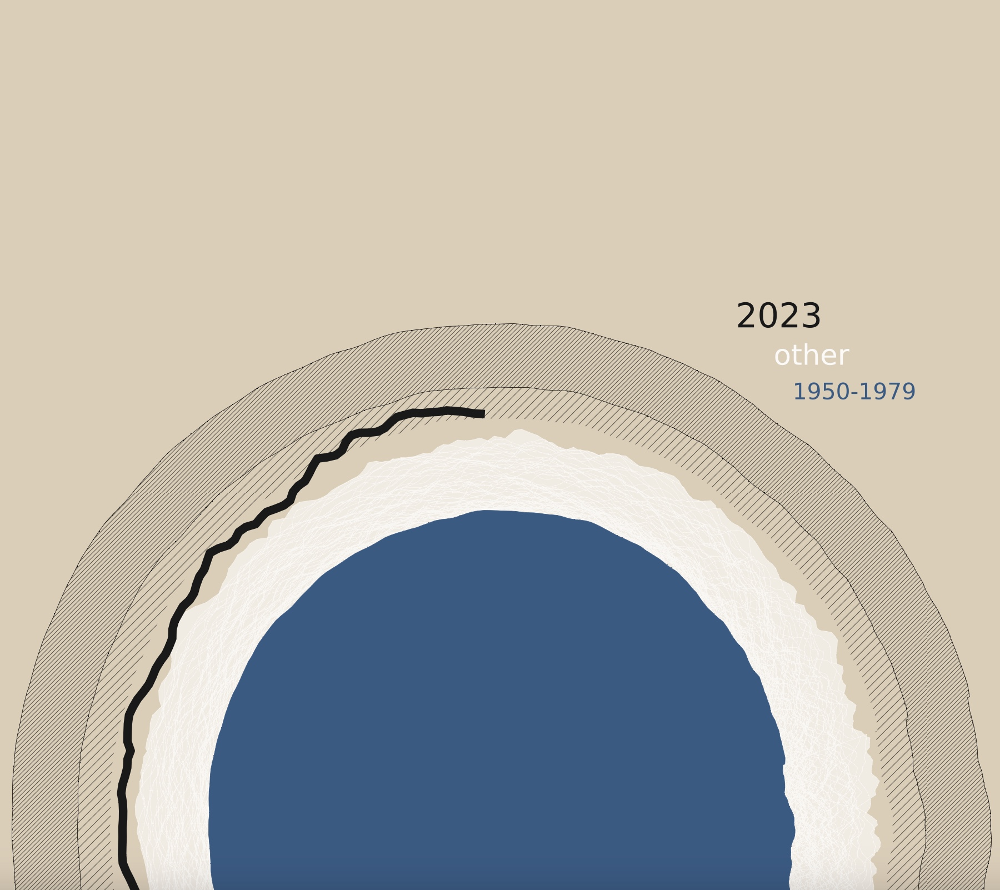

# LittlePicture2023
Notebook to reproduce the submission Out of Orbit to the [Little Pictures of climate competition 2023](https://climate.esa.int/en/littlepicturescompetition/). Click [here](./LittlePictures_ERA5_global_2t.ipynb) to see all steps to reproduce the image below.

## Out of Orbit by Thomas Rackow

[DOWNLOAD DATA](https://climate.copernicus.eu/sites/default/files/custom-uploads/Page%20Uploads/September%2023%20CB/PR/era5_daily_series_2t_global_1940-2023.csv)

## Description

In my piece "Out of Orbit", Earth's typical global temperatures are visualised as the atmosphere around Earth. The year 2023, in particular summer 2023, stands out against the previous years, similar to an object that goes beyond Earth's orbit (at times already beyond the 1.5 degree warming level).

The Earth is plotted in blue as the 1950-1979 baseline. All other (following) years span the "atmosphere", while 2023 is plotted with a bold dark line. The two shaded areas show a 1.5 - 2 degree warmer world, and a 2 - 3 degree warmer world, respectively.

## Data and method

The visualisation is entirely data-based, using ERA5 data for 1940-2023, available from the [Copernicus press release](https://climate.copernicus.eu/copernicus-september-2023-unprecedented-temperature-anomalies) "September 2023 – unprecedented temperature anomalies; 2023 on track to be the warmest year on record". Used Python packages are matplotlib, numpy, and pandas. 

The notebook makes use of polar coordinates, plotting the global temperatures in the complex plane,

$$ z = x + iy = r * e^{i \phi} \text{ .} $$

Larger distances to the centre of Earth, $r = | z |$, correspond to warmer values, smaller distances to colder values. One clockwise revolution around Earth corresponds to the timespan of one year (the direction is set via ax.set_theta_direction(-1.)). The globe is rotated (ax.set_theta_zero_location("E", offset=20)), such that individual years start towards the "Eastern" side of the plot in January (with some offset), and September is thus always towards the top ("North") of the plot. For 2023, in particular, this means that we are "out of orbit" at the top of the plot in September 2023.
